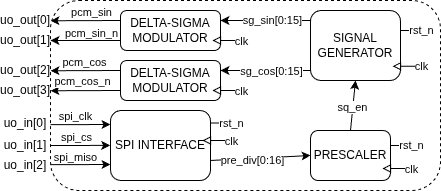
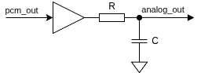

<!---

This file is used to generate your project datasheet. Please fill in the information below and delete any unused
sections.

You can also include images in this folder and reference them in the markdown. Each image must be less than
512 kb in size, and the combined size of all images must be less than 1 MB.
-->

## How it works
This project generates two sinusoidal waveforms with a fixed 90° phase offset (I/Q signals) using Direct Digital Synthesis (DDS) techniques.
The output is presented on output in Pulse Code Modulation via two first order Sigma-Delta modulators.
DSS block can be prescaled by sending the prescaler value through SPI port.

Oscillator design is based on the following paper:
[J. Nam, A Study of Sinusoid Generation Using Recursive Algorithms](https://ccrma.stanford.edu/~juhan/pubs/jnam-emile05.pdf)

### Block diagram

### PINPUT
Inputs:
- `spi_clk = uo_in[0]`
- `spi_cs = uo_in[1]`
- `spi_miso = uo_in[2]`

Outputs:
- `pcm_sin = uo_out[0]`
- `pcm_sin_n = uo_out[1]`
- `pcm_cos = uo_out[2]`
- `pcm_cos_n = uo_out[3]`

## How to test
### Basic test
 - Reset device by putting `rst_n = 0` while providing a clock signal cycle on `clk` pin.
 - While keeping `spi_cs = 0` provide 50MHz clock to `clk` pin, a 1kHz PCM sine and cosine signal should be visible respectively on `pcm_sin` and `pcm_cos` pins.
 - `pcm_sin_n` and `pcm_cos_n` pins are the negated counterparts.
### Full test
- Buffer the outputs `pcm_sin`, `pcm_cos`, `pcm_sin_n` and `pcm_cos_n` with for example a 74AC244 Digital buffer IC and filter them with a RC filter (suggested cutoff frequecy 50-100 kHz range).
- Observe sine and cosine analog outputs.
- Using SPI port, the prescaler `pre[15:0]` cane be loaded with new value allowing for output signals frequency control. After reset prescaler default value is `0x0124` corresponding to 1kHz. In general output frequency is given by rougthly `f_sig = f_clk / pre[15:0] / 400`

### Output wiring diagram

## External hardware

Recomanded hardware:
- Digital buffer IC (e.g: 74AC244)
- n.2 RC filters
    - R = 220 ohm
    - C = 10 nF
